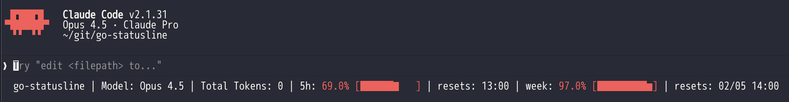

# statusline

Claude Code ステータスライン表示ツール

## 概要

このプログラムは、Claude Code のステータスラインにモデル名、トークン使用量、5時間使用率、週間使用率、リセット時刻を表示します。

## クイックスタート

1. **インストール:** `make install`
2. **設定:** `~/.claude/settings.json` に以下を追加
   ```json
   "statusLine": {"type": "command", "command": "~/.claude/statusline"}
   ```
3. **起動:** `claude` を実行

詳細は以下のセクションを参照してください。

## 必要環境

- golang 1.21以上（ビルド時のみ）
- Claude Code の認証情報が `~/.claude/.credentials.json` に保存されていること
  - Claude Code にログインすると自動的に作成されます
  - macOS では Keychain に保存される場合もあります

## インストール

### ビルド済みバイナリをインストール

```bash
make install
```

### 手動インストール

```bash
# ビルド
make build

# バイナリをコピー
cp statusline ~/.claude/statusline
chmod +x ~/.claude/statusline
```

### settings.json を更新

`~/.claude/settings.json` を編集：

```json
{
  "statusLine": {
    "type": "command",
    "command": "~/.claude/statusline"
  }
}
```

## 使い方

Claude Code を起動すると、ステータスラインに以下のような情報が表示されます：



5h, week はプログレスバー付きで表示され、使用率に応じて色が変化します：
- 0-24%: 緑
- 25-49%: 黄
- 50-74%: オレンジ
- 75-100%: 赤

## 出力フィールド

| フィールド | 説明 |
|-----------|------|
| go-statusline | アプリケーション名 |
| Model | 現在のモデル名 |
| Total Tokens | 累積トークン数（入力 + 出力） |
| 5h | 5時間使用率（パーセンテージ + プログレスバー） |
| resets (5h) | 5時間枠の次のリセット時刻（HH:MM形式） |
| week | 週間使用率（パーセンテージ + プログレスバー） |
| resets (week) | 週間枠の次のリセット時刻（MM/DD HH:MM形式） |

## 設定

設定ファイル `~/.config/go-statusline/config.json` で表示内容をカスタマイズできます。

### 設定項目

| 設定キー | デフォルト | 説明 |
|----------|-----------|------|
| `show_app_name` | true | 「go-statusline」の表示 |
| `show_model` | true | モデル名の表示 |
| `show_tokens` | true | トークン数の表示 |
| `show_5h_usage` | true | 5時間使用率の表示 |
| `show_5h_resets` | true | 5時間リセット時刻の表示 |
| `show_week_usage` | true | 週間使用率の表示 |
| `show_week_resets` | true | 週間リセット時刻の表示 |
| `bar_width` | 20 | プログレスバーの幅（文字数） |

### 設定ファイル例

デフォルト設定（全て表示）:

```json
{
  "show_app_name": true,
  "show_model": true,
  "show_tokens": true,
  "show_5h_usage": true,
  "show_5h_resets": true,
  "show_week_usage": true,
  "show_week_resets": true,
  "bar_width": 20
}
```

コンパクト設定:

```json
{
  "show_app_name": false,
  "show_model": false,
  "show_tokens": false,
  "bar_width": 10
}
```

出力例:
```
5h: 34.0% [███▃      ] | resets: 14:00 | week: 22.0% [██▂       ] | resets: 02/05 14:00
```

設定ファイルが存在しない場合は、初回実行時にデフォルト設定でファイルが自動生成されます。生成されたファイルを編集してカスタマイズしてください。一部の項目のみ設定した場合、指定していない項目はデフォルト値が使用されます。

## キャッシュ

使用データは `~/.config/go-statusline/cache.json` にキャッシュされます。キャッシュの有効期限は **2分間** で、期限が切れると自動的にAPIから最新のデータを取得します。また、`~/.claude/history.jsonl` が更新された場合もキャッシュを無効化してAPIから再取得します（ただし最小30秒間隔）。

### キャッシュ構造

```json
{
  "resets_at": "2026-01-05T14:00:00Z",
  "utilization": 34.0,
  "weekly_utilization": 22.0,
  "weekly_resets_at": "2026-01-10T14:00:00Z",
  "cached_at": 1736072345
}
```

### 旧キャッシュからの移行

以前のバージョンで `~/.claude/.usage_cache.json` にキャッシュが保存されていた場合、初回実行時に自動的に新しい場所へ移行されます。

## XDG Base Directory 対応

設定ファイルとキャッシュファイルは XDG Base Directory Specification に準拠しています。`XDG_CONFIG_HOME` 環境変数が設定されている場合、`$XDG_CONFIG_HOME/go-statusline/` が使用されます。

## トラブルシューティング

### ステータスラインが表示されない

1. **settings.json の設定を確認**
   ```bash
   cat ~/.claude/settings.json
   ```
   `statusLine` の設定が正しいか確認してください。

2. **バイナリの存在を確認**
   ```bash
   ls -la ~/.claude/statusline
   ```

3. **手動実行でエラーを確認**
   ```bash
   echo '{"model":{"display_name":"Test"},"context_window":{"total_input_tokens":0,"total_output_tokens":0}}' | ~/.claude/statusline
   ```

### 認証エラー（API request failed: status 401）

アクセストークンの期限が切れている可能性があります。

1. **Claude Code に再ログイン**
   ```bash
   claude logout
   claude login
   ```

2. **キャッシュをクリア**
   ```bash
   rm ~/.config/go-statusline/cache.json
   ```

### 使用率が更新されない

キャッシュが残っている可能性があります。

```bash
rm ~/.config/go-statusline/cache.json
```

キャッシュは2分間有効です。また、`~/.claude/history.jsonl` が更新されると自動的にキャッシュが無効化されます。

### 設定が反映されない

設定ファイルのJSONが正しいか確認してください。

```bash
cat ~/.config/go-statusline/config.json | jq .
```

エラーが出る場合はJSONの構文エラーがあります。設定ファイルを削除すると、次回実行時にデフォルト設定で再生成されます。

```bash
rm ~/.config/go-statusline/config.json
```

## アンインストール

### 1. settings.json から設定を削除

`~/.claude/settings.json` から `statusLine` の設定を削除します。

変更前:
```json
{
  "statusLine": {
    "type": "command",
    "command": "~/.claude/statusline"
  },
  "other_setting": "value"
}
```

変更後:
```json
{
  "other_setting": "value"
}
```

### 2. バイナリを削除

```bash
rm ~/.claude/statusline
```

### 3. 設定ファイルとキャッシュを削除

```bash
rm -rf ~/.config/go-statusline
```

XDG_CONFIG_HOME を設定している場合:
```bash
rm -rf $XDG_CONFIG_HOME/go-statusline
```

## 開発

### ビルド

```bash
# 現在のプラットフォーム向けビルド
make build

# 全プラットフォーム向けビルド
make build-all
```

### テスト

```bash
# テスト実行
make test

# カバレッジ付きテスト
go test -cover

# ベンチマーク
go test -bench=. -benchmem
```

### クロスコンパイル

```bash
# Linux (amd64)
GOOS=linux GOARCH=amd64 go build -ldflags="-s -w" -o statusline-linux-amd64

# macOS (Intel)
GOOS=darwin GOARCH=amd64 go build -ldflags="-s -w" -o statusline-darwin-amd64

# macOS (Apple Silicon)
GOOS=darwin GOARCH=arm64 go build -ldflags="-s -w" -o statusline-darwin-arm64
```

## サポートプラットフォーム

- Linux (amd64, arm64)
- macOS (Intel, Apple Silicon)

## パフォーマンス

### ベンチマーク結果

```
BenchmarkFormatTokens-16       4960544    237.1 ns/op    24 B/op    2 allocs/op
BenchmarkIsCacheValid-16      26394518     45.86 ns/op    0 B/op    0 allocs/op
BenchmarkFormatResetTime-16   11438455    103.8 ns/op     5 B/op    1 allocs/op
```

## ライセンス

MIT License

## 関連リンク

- [Claude Code](https://claude.com/claude-code)
